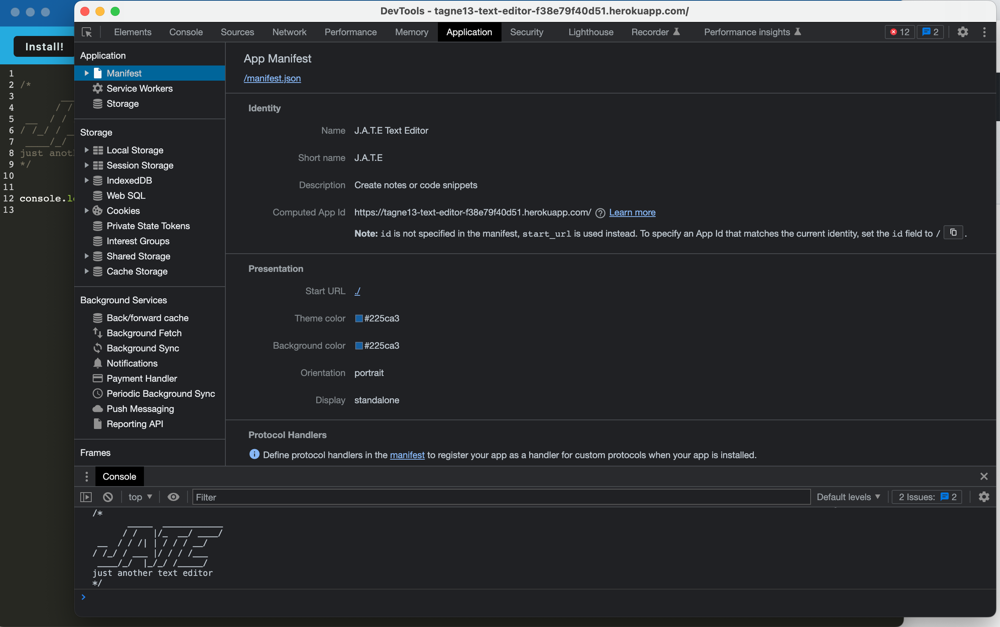
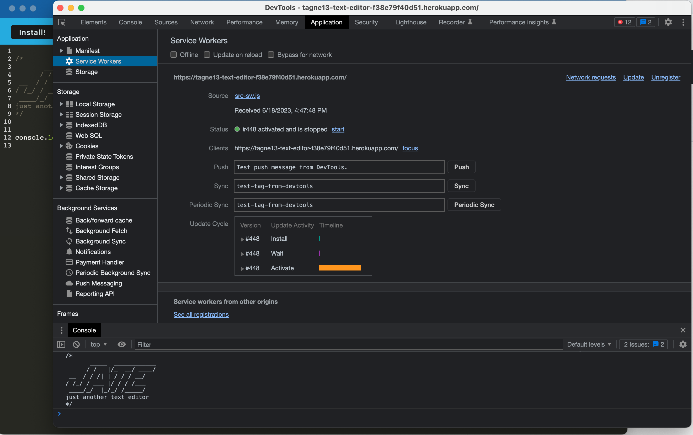
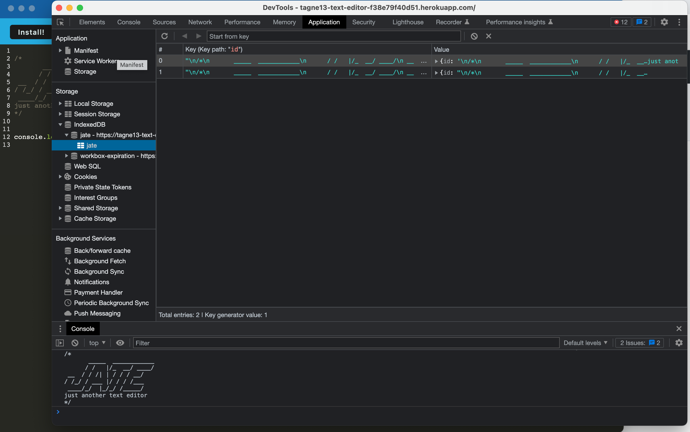

# 19-Text-Editor

  
    
  ## Table of Contents

  * [Description](#description)
  * [Installation](#installation)
  * [Usage](#usage)
  * [License](https://choosealicense.com/licenses/MIT)
  * [Contributing](#contributing)
  * [Tests](#tests)
  * [Questions](#questions)
  
  ## [Description](#table-of-contents)

  J.A.T.E is a Progressive Web Application (PWA) that runs in the browser, offline and can be installed locally to your machine. This application features a number of data persistence techniques, insuring the application runs regardless of browser supported function. J.A.T.E uses an IndexedDB database and the idb package. This application is deployed to Heroku,

  ## [Installation](#table-of-contents)

  To run J.A.T.E locally:

  1. Pull down and/or fork this repository
  2. Run npm i to install all dependencies
  3. Invoke application with npm run start

  From here, you can hit the installation button to install to your machine in order to be able to work offline.

  ## [Usage](#table-of-contents)

  THis application is deployed using [Heroku](https://tagne13-text-editor-f38e79f40d51.herokuapp.com/)

  

  The following image shows the application's manifest.json file:

  

  The following image shows the application's registered service worker:

  

  The following image shows the application's IndexedDB storage:

  

  ## [License](#table-of-contents)

  The application is covered under the following license:
    
  [MIT](https://choosealicense.com/licenses/MIT)
    
  ## [Contributing](#table-of-contents)

  [Starter code](https://github.com/coding-boot-camp/cautious-meme) was provided by Xander Rapstine ([Xandromus](https://github.com/Xandromus))

  ## [Tests](#table-of-contents)

  N/A

  ## [Questions](#table-of-contents)

  Please contact me using the following links:

  [GitHub](https://github.com/Tagne13)

  [Email: Tagne13@gmail.com](mailto:Tagne13@gmail.com)